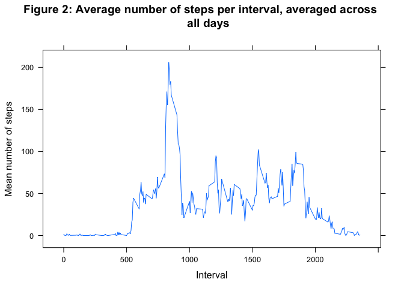
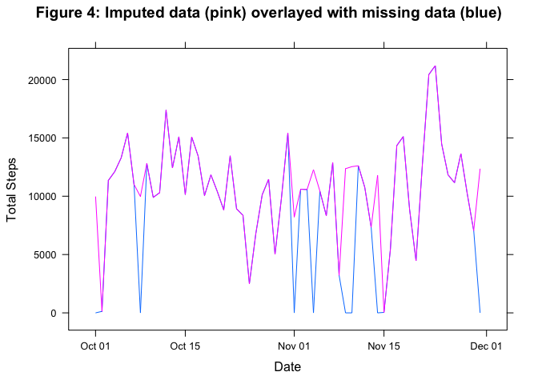
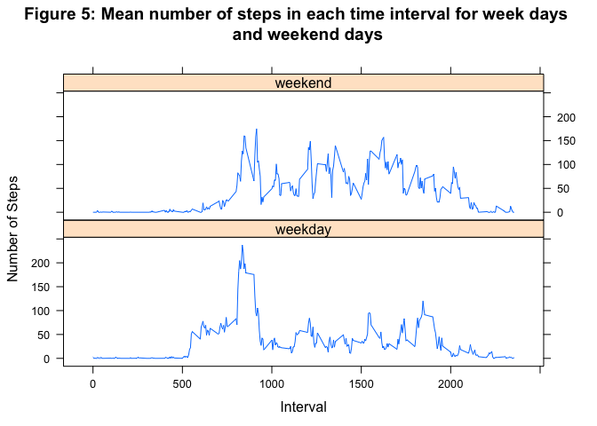

# Reproducible Research: Peer Assessment 1
--------------------------------------------------------------------------------  

## Loading and preprocessing the data  
  
There are three variables in the raw data file *activity.csv*:   
    
- **steps**, the number of steps taken in the specified five minute interval  
- **date**, the date on which the measurement was recorded, and  
- **interval**, a character representation of interval start time.  
  
These data were read into the dataframe *df* and examined using *summary()*,   
*nrow()*, and *is.na()* for data input errors such as incorrect date  
formatting, out-of-range interval values, etc.  Nothing noteworthy was observed,  
except for a number of missing values for the step data, which are discussed  
below.
  
In order to better visualize the interval start time data, the *interval* column   
was transformed into a new factor *todIntStart*, which was added to the dataframe.  
This variable displays the hour separated from the minutes by a colon. Thus,  
for example, *55* becomes *0:55* and *2134* becomes *21:34*.
  

```r
library(plyr)
library(lattice)

# Load the raw data, and define column classes
df <- read.csv("activity.csv", header=TRUE, 
    colClasses=c("integer","Date","integer"))

# Create a new column called "todIntStart", transforming "interval" into the 
# form hr:min e.g. 23:55 
todIntStart=as.character(df$interval)
for (i in 1:nrow(df)){
    if (nchar(todIntStart[i])==2) {
        todIntStart[i]<-paste("0",todIntStart[i],sep="") 
    } else if (nchar(todIntStart[i])==1) {
        todIntStart[i]<-paste("00",todIntStart[i],sep="")
    }
}

# cbind the two parts of "todIntStart" to "df", adding the colon separator 
df<-cbind(df,paste(substring(todIntStart,nchar(todIntStart)-3,
    nchar(todIntStart)-2),substring(todIntStart,nchar(todIntStart)-1,
    nchar(todIntStart)),sep=":"))

colnames(df)[4] <- "todIntStart"
```
##### A brief description of the data

There are 17568 five minute collection intervals in this dataset, with 
the first interval   
starting at 
0:00 
hours on 2012-10-01 and the last interval starting at 
23:55 
hours   
on 2012-11-30.


```r
# number of rows in df = number of collection intervals:
nrow(df) 
```

```
## [1] 17568
```

```r
# first interval starting time:
df[df$date==min(df$date) & df$interval==min(df[df$date==min(df$date),3]),4]
```

```
## [1] 0:00
## 288 Levels: 0:00 0:05 0:10 0:15 0:20 0:25 0:30 0:35 0:40 0:45 0:50 ... 9:55
```

```r
# data collection start date:
min(df$date)
```

```
## [1] "2012-10-01"
```

```r
# last interval starting time:
df[df$date==max(df$date) & df$interval==max(df[df$date==max(df$date),3]),4]
```

```
## [1] 23:55
## 288 Levels: 0:00 0:05 0:10 0:15 0:20 0:25 0:30 0:35 0:40 0:45 0:50 ... 9:55
```

```r
# data collection end date:
max(df$date)
```

```
## [1] "2012-11-30"
```

The measurements were made on a single subject, with 
15264 observations recorded 
and 
2304 observations missing. These are coded as *NA*. For 
each day, there are 288 interval 
measurements,   
12 per hour. 

```r
# number of observations recorded:
nrow(df)-sum(is.na(df$steps))
```

```
## [1] 15264
```

```r
# number of observations missing:
sum(is.na(df$steps))
```

```
## [1] 2304
```

```r
# number of intervals in a day:
nlevels(unique(as.factor(df$interval)))
```

```
## [1] 288
```

## What is the mean total number of steps taken per day?    

Omitting missing values, a histogram of the total number of steps taken each day     
is shown in Figure 1:    

```r
histdata <- ddply(df, .(date), 
    summarize 
    , totalsteps=sum(steps,na.rm=TRUE) 
    , intervalmean=mean(steps, na.rm=TRUE)
    , intervalmedian=median(steps, na.rm=TRUE))

hist(histdata$totalsteps, breaks=20, xlab="Total number of steps", 
    ylab="Frequency", main="Figure 1: Total number of steps taken per day")  
```

 

The mean total number of steps taken per day is
9354.2 
and the median total number of steps  
per day is
10395.0.  


```r
meanWithMissing <- mean(histdata$totalsteps)
meanWithMissing
```

```
## [1] 9354.23
```

```r
medianWithMissing <- median(histdata$totalsteps)
medianWithMissing
```

```
## [1] 10395
```
  
## What is the average daily activity pattern? 


```r
# create new dataframe with average number of steps for each interval
plotdata <- ddply(df, .(interval), summarize, meansteps=mean(steps,na.rm=TRUE))
```
  
  A time series plot of the average number of steps taken, averaged across all 
  days (with *interval*   
  as the temporal variable) is shown in Figure 2. The 
  maximum, at interval number 
  835, is easily   
  detected.  This is the five minute interval that, on average, 
  across all the days in the dataset,   
  contains the maximum mean number of steps, 
  206.2.

```r
xyplot(plotdata$meansteps ~ plotdata$interval, type = "l", xlab="Interval", 
    ylab="Mean number of steps", 
    main = "Figure 2: Average number of steps per interval, averaged across 
    all days" )
```

 

```r
# interval corresponding to peak in graph:
plotdata[plotdata$meansteps==max(plotdata$meansteps),]
```

```
##     interval meansteps
## 104      835  206.1698
```

## Imputing missing values  
  
If we can assume that the subject does the same thing at the same time of day   
each day, an estimate of the missing step values can be derived by calculating   
the mean number of steps per interval per day. So, for example, if our subject   
walks to the gym every Monday at 6:00 a.m., goes to class at 7:30 a.m on Fridays,   
works at home on Wednesdays, etc., the average number of steps in the time   
period for each day should be a reasonable approximation of the values that are   
missing. There are 2304 missing values to be imputed.


```r
# number of missing values to be imputed:
sum(is.na(df$steps))  
```

```
## [1] 2304
```

```r
# add day of week column to dataframe and calculate average for each 
# day/interval pair
dayOfWeek <- weekdays(df$date)
df <- cbind(df, dayOfWeek)
aveByDayAndInterval <- ddply(df, .(dayOfWeek,interval), summarize, 
    mean=mean(steps, na.rm=TRUE))

# Create a new dataset that is equal to the original dataset but with the 
# missing data filled in.
df2 <- merge(df,aveByDayAndInterval, by.x=c("dayOfWeek","interval"),  
    by.y=c("dayOfWeek","interval"))
colnames(df2)[6] <- "meanForIntDayPair"

# Fill in the estimate for each missing value
for(i in 1:nrow(df2)) {
    if(is.na(df2$steps[i])==TRUE) df2$steps[i]=df2$mean[i]
    }
```
A histogram of the total number of steps taken each day is shown in Figure 3.  


```r
histdata2 <- ddply(df2, .(date), summarize, totalsteps=sum(steps,na.rm=TRUE))
hist(histdata2$totalsteps, breaks=20, xlab="Interval", 
    main="Figure 3: Total number of steps taken per day with imputed values 
    included")
```

 
  
The mean total number of steps taken per day for the estimated data is 
10821.2   
and the median total number of steps per day is 
11015.0.

```r
meanWithImpute <- mean(histdata2$totalsteps)
meanWithImpute
```

```
## [1] 10821.21
```

```r
medianWithImpute <-median(histdata2$totalsteps)
medianWithImpute
```

```
## [1] 11015
```

If these numbers are compared to the original mean and median calculated on the     
missing data, it is clear that missing values make a difference in the   
interpretation of the data. The differences in the means and medians is shown  
below.   

By adding estimates for the missing steps, the estimated mean increases  
by 15%. The median is less affected, increasing by 6%, but 6% may be substantial,  
depending upon the context and how the results are to be used.  Missing values, 
in this   
case, cause the mean and median to be underestimated.


```r
matrix(c(meanWithMissing,meanWithImpute,meanWithImpute-meanWithMissing,
         round(100*(meanWithImpute-meanWithMissing)/meanWithMissing,1),
         medianWithMissing,medianWithImpute,medianWithImpute-medianWithMissing,
         round(100*(medianWithImpute-medianWithMissing)/medianWithMissing,1)
    )
    ,nrow = 2, ncol = 4, byrow = TRUE,
    dimnames = list(c("Mean", "Median"), 
    c("With Missing", "With Imputed", "Difference", "% Difference")))
```

```
##        With Missing With Imputed Difference % Difference
## Mean        9354.23     10821.21    1466.98         15.7
## Median     10395.00     11015.00     620.00          6.0
```

The effect of imputing missing values has even more of an effect on the daily    
totals.  In the plot in Figure 4, the blue and pink lines (the datasets with  
missing and imputed data respectively) are overlayed for a large portion of the  
plot. There is a vast difference in the continuity of the series, however,   
when the blue lines peak downward to zero, indicating missing values.  The pink  
graph *seems* much more stable, but this could be very misleading.  The   
assumption was that the subject's weekly routine was the same, which may or may  
not be more accurate than assuming no activity when values are missing. Either   
way, imputing missing values makes a big difference to the interpretation of 
the data.
  

```r
totals1 <- cbind(histdata[,1:2],c("Before"))
colnames(totals1)<-c("date","totalSteps","When")
totals2 <- cbind(histdata2[,1:2],c("After"))
colnames(totals2)<-c("date","totalSteps","When")
totals<-rbind(totals1,totals2)

xyplot(totals$totalSteps ~ totals$date, type = "l", groups=totals$When, 
    xlab="Date", ylab="Total Steps", 
    main="Figure 4: Imputed data (pink) overlayed with missing data (blue)")
```

 

## Are there differences in activity patterns between weekdays and weekends?  

A two level factor variable *weekPart* was created to indicate whether the    
given date is a *weekday* or *weekend* day.  Plots of each subset are shown in   
Figure 5. There is a different pattern on the weekend than there is during  
the week, and overall, fewer steps are taken.  However, the largest peaks do  
occur at the same time each day, indicating some continuity in routine   
regardless of day of the week.  


```r
df2 <- cbind(df2,c("weekday"))
colnames(df2)[7]<-"weekPart"

df2$weekPart<-as.character(df2$weekPart)
df2$weekPart[df2$dayOfWeek=="Saturday" | df2$dayOfWeek=="Sunday"] <- "weekend"
df2 <- df2[order(df2$date, df2$interval),]
plotdata2 <- ddply(df2, .(interval, weekPart),summarize, 
    meansteps=mean(steps,na.rm=TRUE))

xyplot(plotdata2$meansteps ~ plotdata2$interval | plotdata2$weekPart, type = "l", 
    groups=df2$weekPart, layout=c(1,2), xlab="Interval", ylab="Number of Steps", 
    main="Figure 5: Mean number of steps in each time interval for week days 
    and weekend days")
```

 
